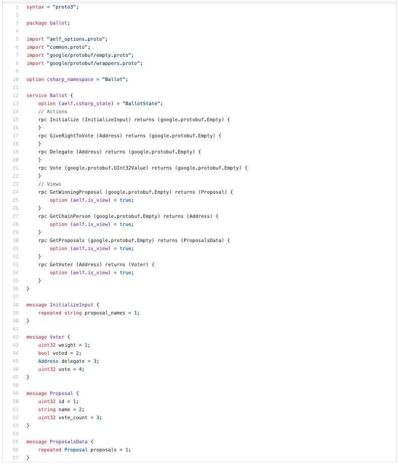
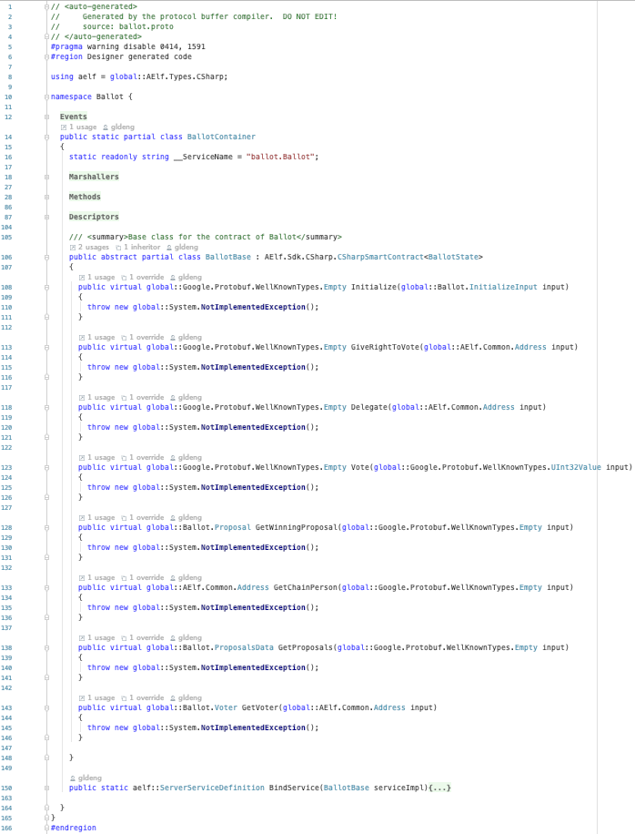
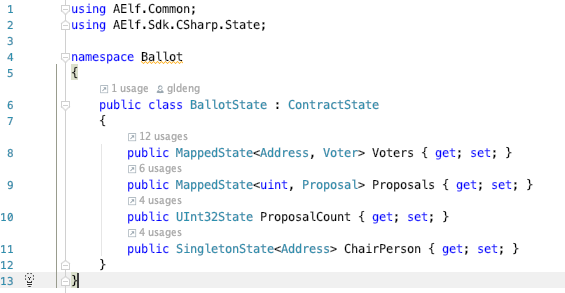
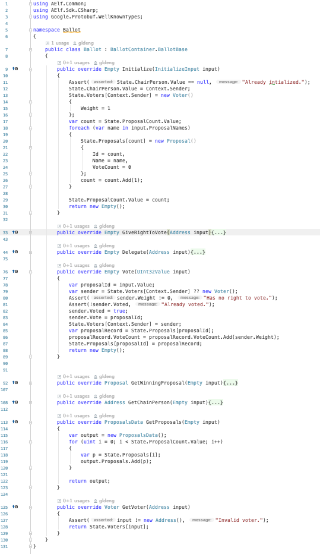
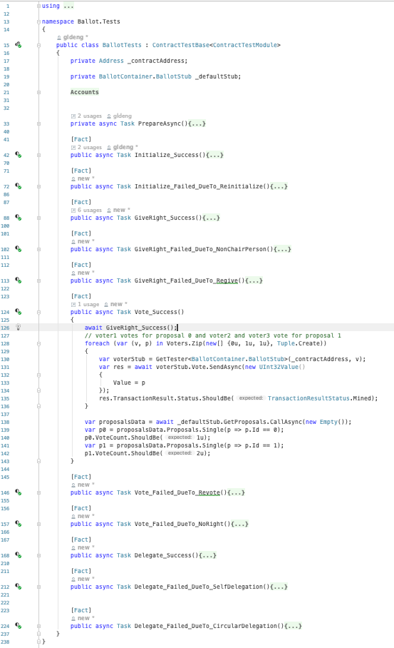
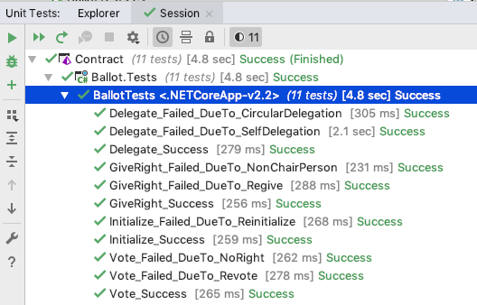
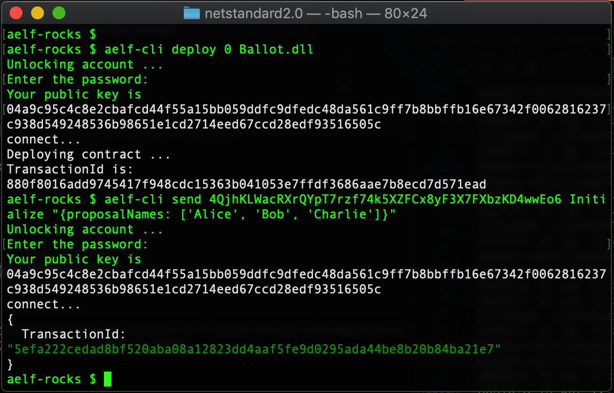
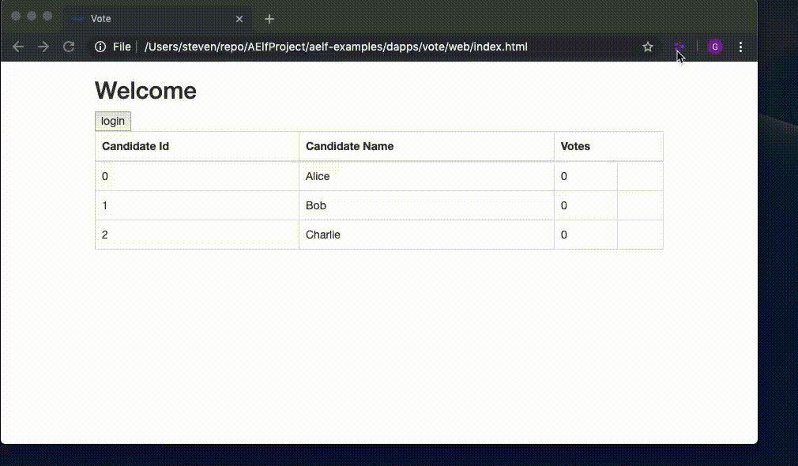

## Smart contract defined in protobuf format
This is familiar to most mainstream developers and it supports multiple languages.

## Smart contract skeleton is generated from protobuf definition using plugin provided by aelf

## State are defined separately from contract/service interface and business logics

## Developers fill the business logics for contract methods directly by following the skeleton

## Unit testings are done in the same way as mainstream software development

## One CLI command for deploying the contract code

## dApp uses aelfjs and the wallet extension to interact with the blockchain

